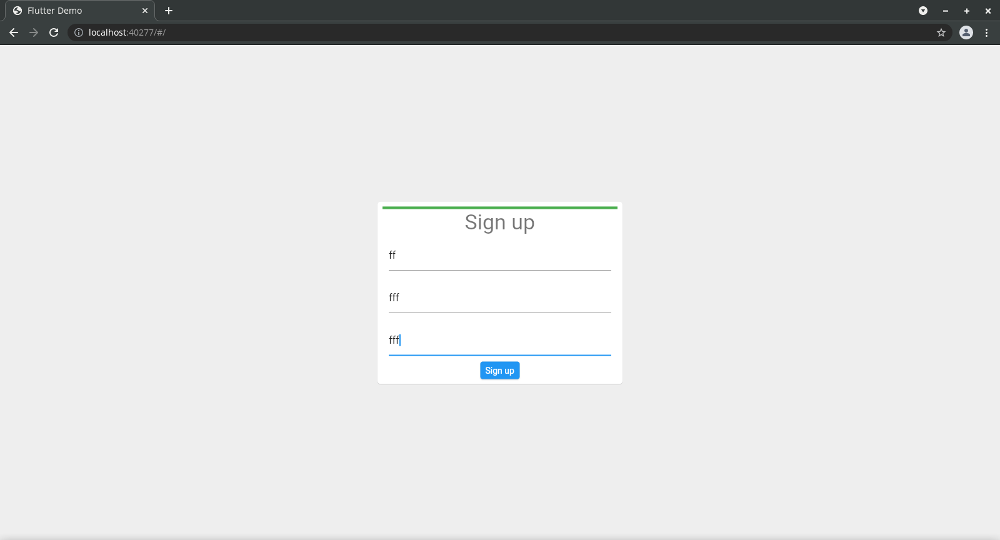
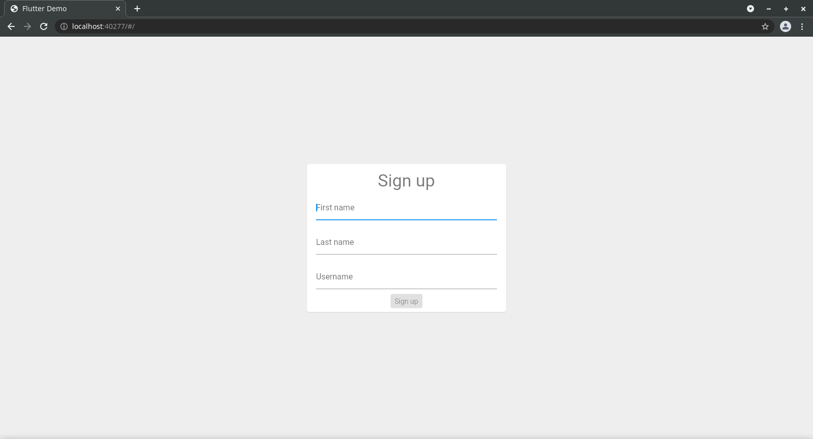
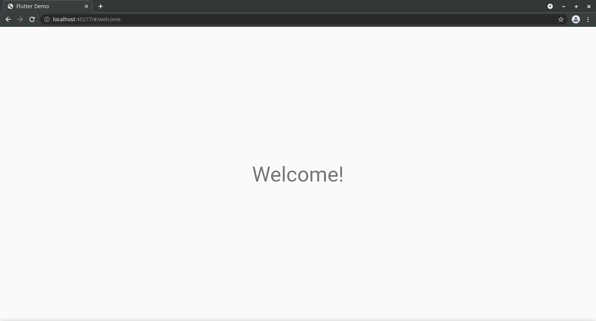
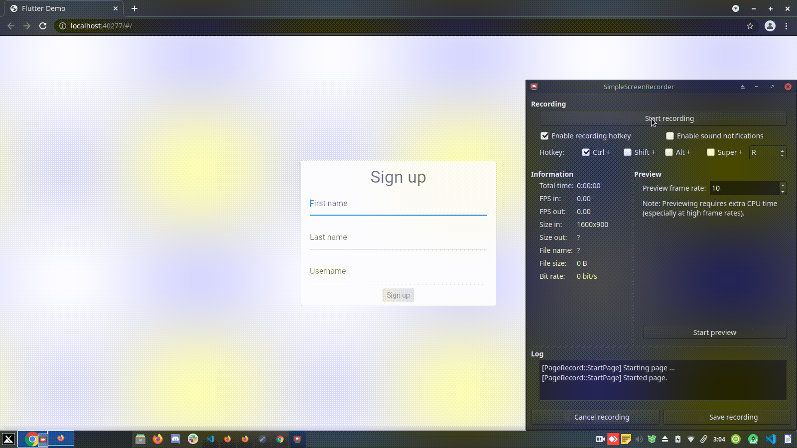

# Web Form Fill

[WebFormLink](https://webflutterform.web.app)

A simple flutter web app that shows a form that has an animated linear indicator that fills up with dynamically changing colors as the form fields are filled.

Below are screenshots of the web app.

## Getting Started

This project is a starting point for a Flutter application.

A few resources to get you started if this is your first Flutter project:

- [Lab: Write your first Flutter app](https://flutter.dev/docs/get-started/codelab)
- [Cookbook: Useful Flutter samples](https://flutter.dev/docs/cookbook)

For help getting started with Flutter, view our
[online documentation](https://flutter.dev/docs), which offers tutorials,
samples, guidance on mobile development, and a full API reference.
